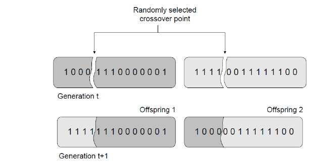

# Genetic Algorithm - TSP
## Description

An implementation of a Genetic Algorithm
as an attempt to solve the 
Travelling Salesman Problem (TSP) using the sample instances from TSPLIB.

### Genetic Algorithms

Inspired by the mechanisms of natural selection proposed
by Charles Darwin, genetic algorithms operate through 
populations of candidate solutions that evolve over 
generations. In each iteration, individuals (chromosomes) 
are selected based on their fitness (objective function), 
combined through crossover operators, and modified by 
mutation operators, promoting the exploration of the 
search space. The evolutionary process ideally leads to 
the progressive improvement of solutions, 
approaching the global optimum or sufficiently good 
solutions.

### Travelling Salesman Problem (TSP)

The Traveling Salesman Problem (TSP) is a 
classic optimization problem. It involves a "salesman" 
who must visit a list of cities exactly once and 
return to the starting city, while minimizing the total 
travel distance (or cost). TSP is known for its 
computational difficulty — it belongs to a class of 
problems called NP-hard, which means that as the 
number of cities increases, the number of possible 
routes grows exponentially, making it very 
challenging to solve efficiently using 
brute-force methods.

### TSPLIB

TSPLIB is a standardized library of sample 
instances for the TSP 
and related combinatorial optimization problems. 
It was created by Gerhard Reinelt to provide researchers
with a common set of benchmark problems for 
testing and comparing algorithms.

## Operators

Naming and describing the operators used in the implementation of the algorithm.

### Single-point crossover

A random position on the chromosome is chosen as the cut 
point; then, the chromosomes of the two parents — selected
as the best in the population — are split at this point. 
For each offspring, the first part of the route is copied
directly from one of the parents, and the second part is 
completed with the remaining cities in the order they 
appear in the other parent, avoiding repetitions. 
This method ensures that the generated offspring represent
valid routes, containing all cities exactly once.

    

Crossover is applied to all chromosomes in the population
in each generation, ensuring constant recombination of 
genetic material and enhancing the exploration of the 
search space. This approach aims to promote continuous 
evolution and avoid premature stagnation in local optima.

### Parcial inversion

The mutation consists of selecting a random cut point 
along the chromosome; then, the second part of the 
sequence (from the point to the end) is inverted.
This technique maintains the validity of the generated
route, respecting the permutation constraint, 
and has the potential to significantly alter the 
traversed path without introducing repeated or 
missing cities.

    

Initially, mutation is applied with a 5% probability 
for each chromosome generated by crossover. 
However, to avoid evolutionary stagnation, 
the algorithm implements an adaptive strategy: 
if the best solution found remains unchanged for 
500 consecutive generations (half the stagnation limit),
the mutation rate is automatically doubled to 10%. 
This measure aims to increase population diversity and 
enable escape from local optima, resuming evolution 
toward better solutions.

### Stopping criterion

The evolutionary process is carried out iteratively 
until a predefined stagnation criterion is met. 
More specifically, the algorithm is terminated when 
the best distance found remains unchanged for 
1,000 consecutive generations. 
This criterion aims to avoid wasting computational 
resources in cases of premature convergence or 
evolutionary stagnation, halting execution only when 
there is no evidence of continued improvement in the 
population. In this way, the algorithm ensures a balance
between persistence in the search for better solutions 
and computational efficiency.

## Conclusion

The results showed that, for small-scale instances, 
the algorithm is capable of reaching the optimal solution with speed and stability. 
For more complex instances, 
although the optimal solution was not found, high-quality routes were obtained, 
with significantly reduced distances over the generations. 

## Author

[ Samuel Salvador](https://github.com/samuel-salvador)